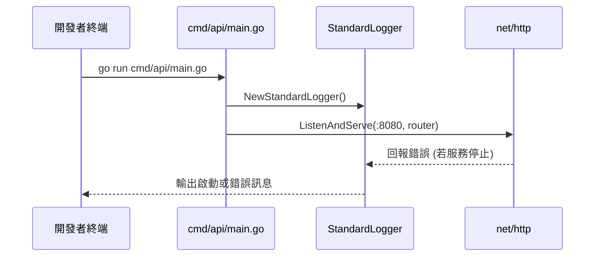
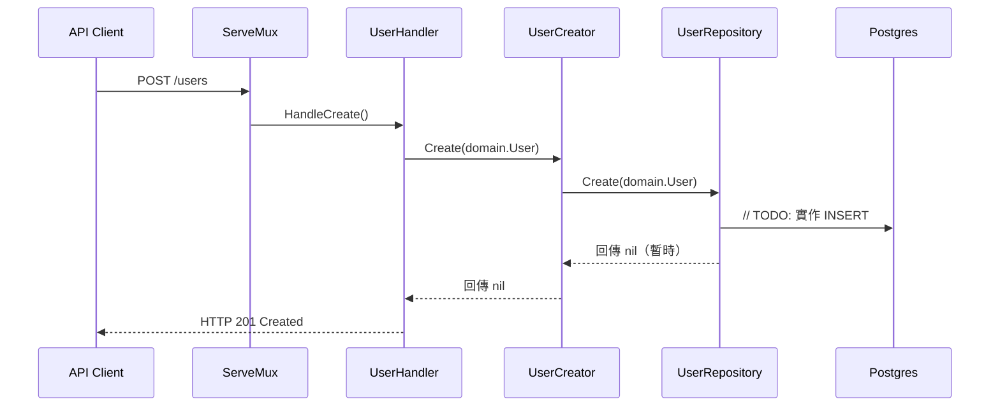

# Subscription System App

此專案提供訂閱系統的 Go 服務骨架，涵蓋 HTTP 介面、領域模型、用例層與資料存取層。針對後續擴充，已依循乾淨架構原則將職責拆分至 `internal` 與 `pkg` 目錄。

## 版本資訊
| 元件 | 版本 | 說明 |
| --- | --- | --- |
| Go | 1.21 | 由 `go.mod` 指定，建議使用同版本開發與建置 |
| Gin | 1.10.1 | 透過 `go get github.com/gin-gonic/gin@latest` 安裝的 HTTP 框架，後續可用於取代標準 `net/http` |
| 相依套件 | 標準函式庫 | 目前仍使用 Go 標準函式庫；Gin 引入的依賴詳見 `go.mod` |
| 開發環境工具 | gofmt/goimports | 隨 Go 1.21 附帶，請在提交前執行程式碼格式化 |

## 檔案結構
```text
yourapp/
├─ AGENTS.md
├─ README.md
├─ assets/
│  └─ README.md
├─ cmd/
│  └─ api/
│     └─ main.go
├─ go.mod
├─ go.sum
├─ internal/
│  ├─ adapter/
│  │  └─ http/
│  │     ├─ router.go
│  │     └─ user_handler.go
│  ├─ domain/
│  │  └─ user.go
│  ├─ infra/
│  │  ├─ db/
│  │  │  ├─ postgres.go
│  │  │  └─ user_repo_pg.go
│  │  └─ log/
│  │     └─ logger.go
│  └─ usecase/
│     └─ user_create.go
├─ main.go
└─ pkg/
   └─ README.md
```

## 功能時序圖

### 服務啟動流程


### 使用者建立流程（POST /users）


## 環境安裝與設定

### macOS (Homebrew)
1. 安裝 Homebrew（若尚未安裝）：`/bin/bash -c "$(curl -fsSL https://raw.githubusercontent.com/Homebrew/install/HEAD/install.sh)"`
2. 安裝 Go 1.21：`brew install go@1.21`
3. 將 Go 加入路徑：`echo 'export PATH="/opt/homebrew/opt/go@1.21/bin:$PATH"' >> ~/.zshrc` 並重新載入終端。
4. 驗證版本：`go version` 應顯示 `go1.21.x`。

### Ubuntu / Debian
1. 更新套件庫：`sudo apt update`
2. 安裝必要工具：`sudo apt install -y build-essential curl`
3. 下載 Go 1.21 壓縮檔：`curl -LO https://go.dev/dl/go1.21.0.linux-amd64.tar.gz`
4. 解壓至 `/usr/local`：`sudo tar -C /usr/local -xzf go1.21.0.linux-amd64.tar.gz`
5. 設定環境變數：`echo 'export PATH="/usr/local/go/bin:$PATH"' >> ~/.profile` 並重新登入終端。
6. 驗證版本：`go version`。

### Windows (PowerShell + Scoop)
1. 以管理員開啟 PowerShell，允許執行：`Set-ExecutionPolicy RemoteSigned -Scope CurrentUser`
2. 安裝 Scoop：`irm get.scoop.sh | iex`
3. 使用 Scoop 安裝 Go：`scoop install go@1.21`
4. 重新開啟 PowerShell，執行 `go version` 驗證。

### 共通設定
- 建議設定 `GOPATH`（若需）：`export GOPATH=$HOME/go`
- 確認 `go env GOPROXY` 為 `https://proxy.golang.org,direct`（預設值即可）。
- 使用 `go fmt ./...` 或 `gofmt` 維持程式碼風格一致。
- 使用 `go get github.com/gin-gonic/gin@latest` 可更新 Gin 版本，以符合最新需求。

## 開發與執行流程
- 啟動服務（快速開發）：`go run cmd/api/main.go`
- 建置檢查：`go build ./...`
- 測試全套件：`go test ./...`
- 靜態分析：`go vet ./...`

## 目錄與模組說明
- `cmd/api`: 應用程式進入點，負責組裝容器、載入設定與啟動 HTTP 服務。
- `internal/domain`: 定義核心領域模型與介面，不依賴外部框架。
- `internal/usecase`: 實作業務規則與流程，透過介面操作資料層。
- `internal/adapter/http`: 提供 HTTP Handler 與路由設定，對外暴露 REST API。
- `internal/infra/db`: 實作資料庫連線與儲存庫邏輯，後續可替換為實際的 PostgreSQL 操作。
- `internal/infra/log`: 統一管理日誌介面與實作。
- `pkg`: 預留可跨專案共用的工具套件。
- `assets`: 放置整合測試資料、樣本 payload 或資料庫遷移腳本。

## 後續工作建議
- 完成 PostgreSQL 連線與 SQL 實作，補上錯誤處理與資料驗證。
- 在 `internal/adapter/http` 增加請求解析與輸入驗證，支援 JSON payload。
- 導入 Gin 後，可評估在 HTTP 層改用 Gin Router，並調整 Handler 實作。
- 撰寫單元測試（`go test ./...`）覆蓋 Use Case 與 Handler。
- 根據需求擴充 README，保持與最新程式狀態同步。
