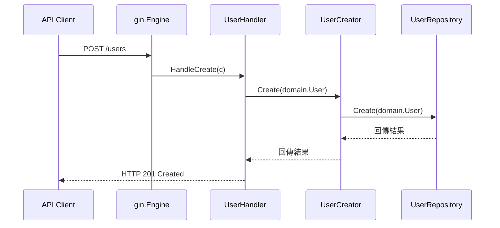

# Gin 路由流程說明

此文件說明專案中 `internal/adapter/http/router.go` 的路由建立流程，以及請求從 Gin 到業務邏輯層的傳遞方式。

## 組態流程
1. 透過 `gin.New()` 建立 `*gin.Engine` 實例。
2. 掛載預設的 `gin.Recovery()` middleware，確保 panic 不會終止服務且能回傳 500。
3. 若注入 `UserHandler`，則註冊 `POST /users` 路由映射至 `UserHandler.HandleCreate`。
4. 回傳設定完成的 `*gin.Engine`，供 `main.go` 呼叫 `Run` 啟動 HTTP 伺服器。

## 請求處理時序

## 擴充建議
- 依據業務需求在 `router.go` 新增其他 RESTful 路由，例如 `GET /users/:id`。
- 可於 `router.Use()` 加入自訂 middleware（驗證、日誌、CORS）。
- 若路由增多，建議依領域拆分群組，例如 `router.Group("/users")`。
